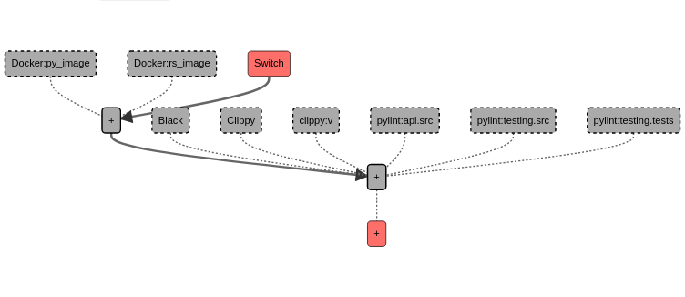

# Jaypore CI

    A CI system that sounds ancient and powerful.
    Like the city of Jaypore.
    

## Expected usage

```bash
curl https://raw.githubusercontent.com/theSage21/jaypore_ci/main/setup.sh | bash
```

- Use the script to install this in any project.
- Configure CI at `.jaypore_ci/cicd.py`
- Each git-push will trigger a CI job.

## Screenshot



## Examples


- <details>
    <summary>Many jobs in parallel</summary>
 
    ```python
    from jaypore_ci import jci

    with jci.Pipeline( image="arjoonn/jaypore_ci:latest", timeout=15 * 60) as p:
        p.in_parallel(
            p.job("python3 -m black --check .", name="Black"),
            p.job("python3 -m pylint jaypore_ci/ tests/", name="PyLint"),
            p.job("python3 -m pytest tests/", name="PyTest"),
        ).should_pass()
    ```
    </summary>
  </details>
- <details>
    <summary>Running tests with dependencies cached in docker</summary>
 
    ```python
    from jaypore_ci import jci

    with jci.Pipeline(image="scratch", timeout=15 * 60) as p:
        p.image = image = f'myproject_{p.remote.sha}'
        p.in_sequence(
            p.job(f"docker build -t {image} .", name="Docker image"),
            p.job("python3 -m pytest tests/", name="PyTest"),
        ).should_pass()
    ```
    </summary>
  </details>
- <details>
    <summary>Complex job dependencies</summary>
 
    ```python
    from jaypore_ci import jci

    with jci.Pipeline(image="arjoonn/jaypore_ci:latest", timeout=15 * 60) as p:
        p.image = image = f"myproject_{p.remote.sha}"

        p.in_sequence(
            p.job(f"docker build -t {image} .", name="Docker image"),
            p.job(
                f"docker tag -t {image} dockerhubaccount/{image}:{p.remote.sha}",
                name="Docker tag",
            ),
            p.job(
                f"docker push dockerhubaccount/{image}:{p.remote.sha}", name="Docker push"
            ),
            p.in_parallel(
                p.job("python3 -m pytest tests/", name="PyTest"),
                p.job("python3 -m pylint src/", name="PyLint"),
                p.job("python3 -m black --check .", name="Black"),
            ),
            p.in_parallel(
                p.in_sequence(
                    p.job("poetry build", name="pypi build"),
                    p.job("poetry publish", name="pypi publish"),
                ),
                p.job("python3 -m create_release_notes", name="release notes"),
                p.job(
                    "python3 -m send_emails_to_downstream_packagers_and_maintainers",
                    name="Notify downstream",
                ),
            ),
        ).should_pass()
    ```
    </summary>
  </details>
- <details>
    <summary>Job matrix</summary>
 
    ```python
    from jaypore_ci import jci

    with jci.Pipeline(image="arjoonn/jaypore_ci:latest", timeout=15 * 60) as p:
        jobs = [
            p.job("python3 -m pytest tests", name=f"Tests: {env}", env=env)
            for env in p.env_matrix(
                BROWSER=["firefox", "chromium", "webkit"],
                SCREENSIZE=["phone", "laptop", "extended"],
                ONLINE=["online", "offline"],
            )
        ]
        # This will have 18 jobs
        # one for each possible combination of BROWSER, SCREENSIZE, ONLINE
        p.in_parallel(*jobs).should_pass()
    ```
    </summary>
  </details>
- <details>
    <summary>TLDR: Running jobs on cloud</summary>

    - We can get the remote machine's docker socket by using [ssh socket forwarding](https://medium.com/@dperny/forwarding-the-docker-socket-over-ssh-e6567cfab160)
    - Then we can set jaypore CI to use the remote docker socket by editing `.jaypore_ci/pre-push.githook`
    </summary>
  </details>
