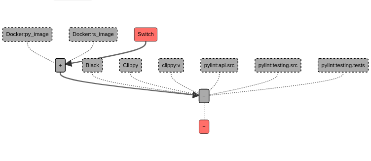

# Jaypore CI

    A CI system that sounds ancient and powerful.
    Like the city of Jaypore.
    

## Expected usage

```bash
curl https://raw.githubusercontent.com/theSage21/jaypore_ci/main/setup.sh | bash
```

- Use the script to install this in any project.
- Configure CI at `.jaypore_ci/cicd.py`
- Each git-push will trigger a CI job.

## Screenshot



## Examples


- <details>
    <summary>Many jobs in parallel</summary>
 
    ```python
    from jaypore_ci import jci

    with jci.Pipeline( image="arjoonn/jaypore_ci:latest", timeout=15 * 60) as p:
        p.job("python3 -m black --check .", name="Black")
        p.job("python3 -m pylint jaypore_ci/ tests/", name="PyLint")
        p.job("python3 -m pytest tests/", name="PyTest")
        # ---
        p.run()
    ```
    </summary>
  </details>
- <details>
    <summary>Running tests with dependencies cached in docker</summary>
 
    ```python
    from jaypore_ci import jci

    with jci.Pipeline(image="scratch", timeout=15 * 60) as p:
        p.image = image = f'myproject_{p.remote.sha}'
        p.job(f"docker build -t {image} .", name="Docker image")
        p.job("python3 -m pytest tests/", name="PyTest", depends_on=['Docker image'])
        # ---
        p.run()
    ```
    </summary>
  </details>
- <details>
    <summary>Complex job dependencies</summary>
 
    ```python
    from jaypore_ci import jci

    with jci.Pipeline(image="arjoonn/jaypore_ci:latest", timeout=15 * 60) as p:
        p.image = image = f"myproject_{p.remote.sha}"
        p.stages = ["docker", "qa", "deploy"]
        # --- docker jobs
        p.job(f"docker build -t {image} .", name="Docker image", stage="docker"),
        p.job(
            f"docker tag -t {image} dockerhubaccount/{image}:{p.remote.sha}",
            name="Docker tag",
            depends_on=["Docker image"],
            stage="docker",
        )
        p.job(
            f"docker push dockerhubaccount/{image}:{p.remote.sha}",
            name="Docker push",
            depends_on=["Docker tag"],
            stage=["docker"],
        )
        # --- QA jobs
        p.job(
            "python3 -m pytest tests/",
            name="PyTest",
            depends_on=["Docker push"],
            stage="qa",
        )
        p.job(
            "python3 -m pylint src/", name="PyLint", depends_on=["Docker push"], stage="qa"
        )
        p.job(
            "python3 -m black --check .",
            name="Black",
            depends_on=["Docker push"],
            stage="qa",
        )
        # --- deploy jobs
        p.job("poetry build", name="pypi build", stage="deploy")
        p.job(
            "poetry publish", name="pypi publish", depends_on=["pypi build"], stage="deploy"
        )
        p.job("python3 -m create_release_notes", name="release notes", stage="deploy")
        p.job(
            "python3 -m send_emails_to_downstream_packagers_and_maintainers",
            name="Notify downstream",
            stage="deploy",
        )
        # --- run
        p.run()
    ```
    </summary>
  </details>
- <details>
    <summary>Job matrix</summary>
 
    ```python
    from jaypore_ci import jci

    with jci.Pipeline(image="arjoonn/jaypore_ci:latest", timeout=15 * 60) as p:
        for env in p.env_matrix(
                BROWSER=["firefox", "chromium", "webkit"],
                SCREENSIZE=["phone", "laptop", "extended"],
                ONLINE=["online", "offline"],
            ):
            p.job("python3 -m pytest tests", name=f"Tests: {env}", env=env)
        # This will have 18 jobs
        # one for each possible combination of BROWSER, SCREENSIZE, ONLINE
        p.run()
    ```
    </summary>
  </details>
- <details>
    <summary>TLDR: Running jobs on cloud</summary>

    - We can get the remote machine's docker socket by using [ssh socket forwarding](https://medium.com/@dperny/forwarding-the-docker-socket-over-ssh-e6567cfab160)
    - Then we can set jaypore CI to use the remote docker socket by editing `.jaypore_ci/pre-push.githook`
    </summary>
  </details>
- <details>
    <summary>With a db service in background</summary>
 
    ```python
    from jaypore_ci import jci

    # Services immediately return with a PASSED status
    # If they exit with a Non ZERO code they are marked as FAILED, otherwise
    # they are assumed to be PASSED
    with jci.Pipeline(image="arjoonn/jaypore_ci:latest", timeout=15 * 60) as p:
        p.stages = ['services', 'testing']
        # --- services
        p.job(image='mysql', name='Mysql', is_service=True, stage='services')
        p.job(image='redis', name='Redis', is_service=True, stage='services')
        p.job("python3 -m src.run_api", name='Myrepo:Api', is_service=True, stage='services')
        # --- testing
        p.job("python3 -m pytest -m unit_tests tests", name="Testing:Unit", stage='testing')
        p.job("python3 -m pytest -m integration_tests tests", name="Testing:Integration", stage='testing')
        p.job("python3 -m pytest -m regression_tests tests", name="Testing:Regression", stage='testing')
        # --- run
        p.run()
    ```
    </summary>
  </details>
