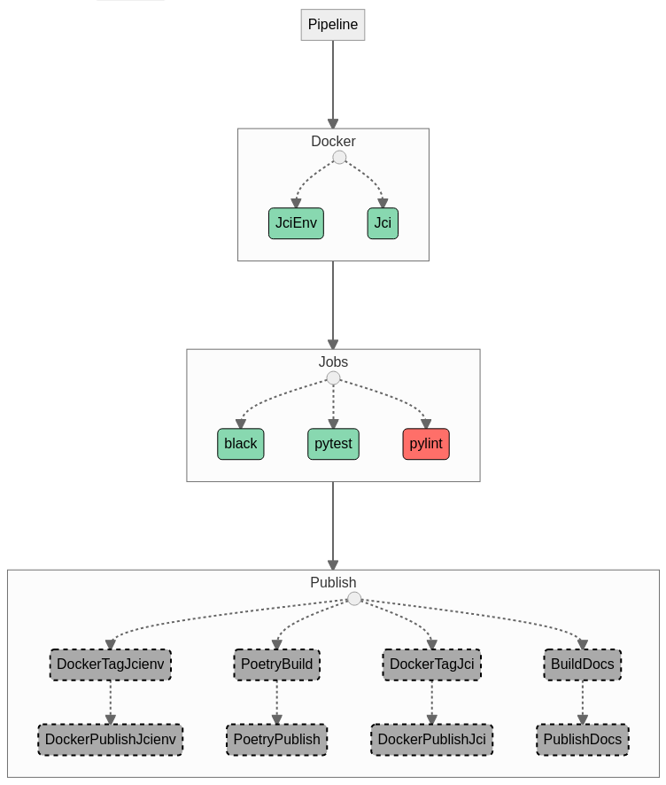

.. Jaypore CI documentation master file, created by
   sphinx-quickstart on Thu Dec 22 13:34:40 2022.
   You can adapt this file completely to your liking, but it should at least
   contain the root `toctree` directive.

Welcome to Jaypore CI's documentation!
======================================

**Jaypore CI** is a Python library for continuous integration / testing / delivery.

It is slightly different from things like github actions, gitlab CI, drone CI and so on.

- The configuration language is python.
- CI runs on your local machine by default. 
- There is no "server". CI reports are added to your pull request / merge request description.

For example, here's a CI pipeline for a project.

Contents
---------------

.. toctree::
   :glob:

   getting_started
   ideas
   examples
   reference/modules.rst
